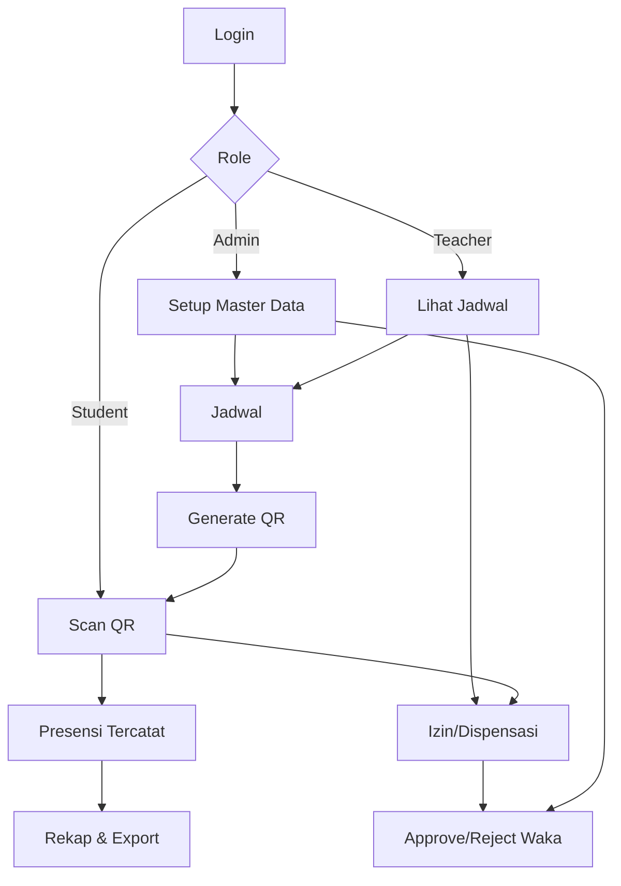

# Userflow Backend QR System (Umum)

Dokumen ini merangkum alur pengguna utama dari sisi backend (API + role/middleware) agar mudah dipetakan ke UI/produk.

## Aktor & Peran
- **Admin**: kelola master data, jadwal, rekap, export, WA, approval izin (khusus admin tipe `waka`).
- **Teacher**: lihat jadwal sendiri, generate QR, scan, rekap & export (sesuai akses), ajukan izin.
- **Student**: scan QR, lihat riwayat presensi, ajukan izin (jika pengurus kelas), kelola device.
- **Class Officer (Student)**: tambahan hak untuk generate/revoke QR dan ajukan izin untuk kelasnya.

## Alur Inti (High-Level)
1. **Login**
   - User login → dapat token → akses endpoint sesuai role.
2. **Setup Master Data (Admin)**
   - Admin siapkan: jurusan, kelas, guru, siswa, tahun ajaran, semester, ruang, mapel, slot waktu.
3. **Jadwal (Schedules)**
   - Admin buat jadwal; guru dapat melihat jadwalnya; admin `waka` bisa bulk update per kelas/hari.
4. **QR Presensi**
   - Admin/guru/pengurus kelas generate QR untuk jadwal tertentu → QR aktif (15 menit default).
5. **Scan Presensi**
   - Siswa/guru scan QR → validasi role, kelas/guru, device (siswa) → attendance tercatat.
6. **Rekap & Export**
   - Admin/guru lihat rekap per jadwal/kelas/bulan → export CSV.
7. **Izin/Dispensasi**
   - Request dibuat oleh siswa (pengurus) / guru → admin `waka` approve/reject.

## Diagram Alur (Mermaid)

## Detail Alur per Aktor

### Admin
- **Login** → token aktif.
- **Master Data** → CRUD semua data referensi (guru/siswa bisa import massal).
- **Jadwal** → CRUD jadwal, bulk update (khusus admin `waka`).
- **QR** → generate/revoke QR untuk presensi.
- **Presensi** → lihat daftar per jadwal, ubah status, batalkan, upload bukti.
- **Rekap/Export** → rekap per bulan/kelas, export CSV.
- **Izin** → list semua request, approve/reject (khusus `waka`).
- **WhatsApp** → kirim teks/media via provider WA (jika konfigurasi aktif).

### Teacher
- **Login** → token aktif.
- **Jadwal** → lihat jadwal sendiri.
- **QR** → generate/revoke QR untuk jadwal yang diajar / kelas wali (bila ada).
- **Presensi** → scan QR (jika diperlukan), lihat rekap jadwal sendiri.
- **Izin** → ajukan request untuk kelas yang diajar/wali.

### Student
- **Login** → token aktif.
- **Device** → daftar device (hanya 1 aktif) atau hapus device.
- **Scan Presensi** → scan QR → attendance tercatat jika valid.
- **Riwayat** → lihat riwayat presensi sendiri.
- **Izin** → ajukan request bila pengurus kelas.

### Class Officer (Student)
- Semua alur Student, ditambah:
- **QR** → generate/revoke QR untuk kelas sendiri (tipe `student`).
- **Izin** → ajukan request untuk kelasnya.

## Alur Validasi Kunci
- **Role/Middleware**: `role`, `admin-type`, `class-officer`.
- **QR Scan**: validasi token, status aktif, belum expired, role sesuai, device siswa aktif, dan keterkaitan kelas/guru.
- **Izin**: hanya admin `waka` yang bisa approve/reject.

## Event Realtime (Broadcast)
- `qr.generated` → update QR aktif per jadwal.
- `attendance.recorded` → update presensi realtime per jadwal.
- `absence.requested`, `absence.updated` → update request izin.
- `schedules.bulk-updated` → update jadwal per kelas.

## Catatan Implementasi
- Satu siswa hanya boleh memiliki **1 device aktif**.
- Jika presensi sudah tercatat untuk jadwal itu, scan berikutnya akan mengembalikan pesan “Presensi sudah tercatat”.
- QR memiliki masa aktif default **15 menit**.

## Pemetaan ke UI (Web/Desktop vs Mobile)

### Web/Desktop (Admin & Teacher)
- **Login** → akses dashboard sesuai role.
- **Master Data (Admin)** → CRUD + import massal.
- **Jadwal** → list/detail/CRUD, bulk update (admin `waka`).
- **QR** → generate/revoke untuk jadwal.
- **Presensi** → list per jadwal, ubah status, batalkan, upload bukti.
- **Rekap/Export** → rekap per kelas/bulan, export CSV.
- **Izin** → list & approve/reject (admin `waka`).
- **WhatsApp** → kirim pesan (admin).

### Web/Desktop (Student)
- **Login** → akses halaman profil/riwayat.
- **Riwayat Presensi** → list presensi sendiri.
- **Device** → daftar/hapus device aktif.
- **Izin** → ajukan request (khusus pengurus kelas).

### Mobile (Student & Teacher)
- **Login** → token aktif.
- **Scan QR** → validasi token/role/device.
- **QR (Opsional)** → generate/revoke untuk pengurus kelas/guru.
- **Riwayat Presensi** → akses cepat dari mobile.
- **Izin** → ajukan request (pengurus kelas/guru).

### Mobile (Admin)
- **Ringkas** → monitoring jadwal, QR aktif, dan rekap singkat.

## Userflow Detail (Semua Role)

### Admin Flow
1. **Login** → masuk dashboard admin.
2. **Setup Master Data** → input/import guru, siswa, kelas, jurusan, mapel, ruang, slot waktu, tahun ajaran, semester.
3. **Kelola Jadwal** → buat/edit/hapus jadwal; bulk update (admin `waka`).
4. **Generate QR** → aktifkan QR per jadwal (atau revoke jika perlu).
5. **Monitoring Presensi** → lihat daftar per jadwal; koreksi status; unggah bukti.
6. **Rekap & Export** → rekap per kelas/bulan; export CSV.
7. **Izin/Dispensasi** → proses approve/reject (khusus `waka`).
8. **WhatsApp** → kirim pesan/informasi ke pihak terkait.

### Teacher Flow
1. **Login** → masuk dashboard guru.
2. **Lihat Jadwal** → daftar jadwal mengajar sendiri.
3. **Generate QR** → buat/revoke QR untuk jadwal yang diajar atau kelas wali.
4. **Scan (Opsional)** → scan QR jika perlu verifikasi.
5. **Monitoring Presensi** → lihat presensi per jadwal.
6. **Rekap & Export** → rekap jadwal/kelas yang diampu.
7. **Izin/Dispensasi** → ajukan untuk kelas yang diajar/wali.

### Student Flow
1. **Login** → masuk aplikasi/portal siswa.
2. **Registrasi Device** → daftar device (hanya 1 aktif).
3. **Scan QR** → presensi tercatat jika valid.
4. **Riwayat Presensi** → lihat daftar kehadiran sendiri.
5. **Izin/Dispensasi** → ajukan izin (khusus pengurus kelas).

### Class Officer (Student) Flow
1. **Semua langkah Student**.
2. **Generate QR** → buat/revoke QR untuk kelas sendiri.
3. **Izin/Dispensasi** → ajukan untuk kelas.
